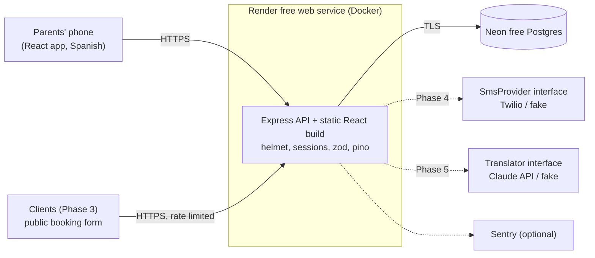
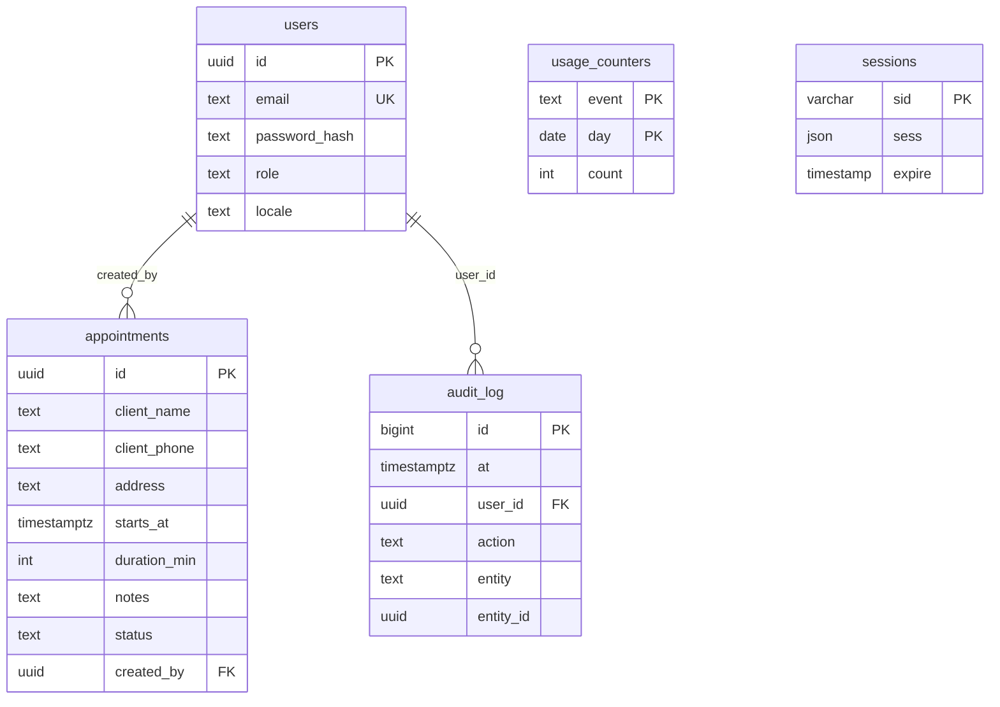

# Architecture

AnyGer's Housekeeping is **one Node app and one Postgres database**. The Express server exposes a JSON API and also serves the built React app, so there is a single deploy, a single URL, and a single thing to monitor.

## System diagram



Dotted lines are later phases or optional.

## Why this size is right (no microservices, no Kubernetes)

The load is two users and a few requests an hour. Splitting into services would add network failure modes, deploy pipelines, and cost, and would buy nothing at this scale. A modular monolith with clear internal seams (`domain/`, `services/`, `routes/`, and adapter interfaces for SMS and translation) is cheap to run and easy to change. If it ever outgrew this, those seams are where it would be split.

## Postgres vs SQLite

SQLite would perform fine at this data size (hundreds of rows a year). Postgres was chosen because:

- Free hosts often have **ephemeral disks**; a SQLite file there can vanish with a redeploy. A managed Postgres survives redeploys and has provider backups.
- `timestamptz` and range operators (used for overlap detection) are first-class.
- Tests run against **real Postgres** in CI, the same engine as production.

Cost of the choice: one more moving part locally (Docker Compose) and a network hop. Accepted.

## Data model (Phase 1)



Planned: `series` and `series_exceptions` (Phase 2), `booking_requests` (Phase 3), `translations` (Phase 5).

## Key decisions and tradeoffs

### Time zones

- **Stored as UTC** `timestamptz`. **Displayed in America/Los_Angeles.**
- Conversion lives in one module, `server/src/domain/time.ts`, using Luxon. The **server** returns each appointment's Pacific `date` and `time`; the browser never converts time zones for appointments, so there is one place to get DST right.
- Spring forward: a time that does not exist (02:30 on 2026-03-08) is **rejected** with a plain-language error instead of silently shifting.
- Fall back: an ambiguous time (01:30 on 2026-11-01) resolves to the **first** occurrence (daylight time). Documented and tested.
- Range queries ask for whole Pacific days, so days are 23, 24, or 25 hours long around DST and tests assert this.
- Tradeoff: the calendar is fixed to Pacific Time. Right for this business; a per-business time zone setting would be needed to generalize.

### Recurrence (Phase 2 design, not yet built)

Store the **rule** (local wall-clock time + frequency + optional end), generate occurrences on demand for the visible window, and materialize only **exceptions** (edited or skipped dates). "Edit this one" writes an exception row; "edit this and future" splits the series. Generating from local wall-clock time then converting to UTC keeps a 9:00 AM cleaning at 9:00 AM across DST. Tradeoff: slightly more complex than pre-generating rows, but changing a series is one write and there is no unbounded row growth.

### SMS abstraction (Phase 4)

`SmsProvider { send(to, body) }` with Twilio and in-memory fake adapters, selected by `SMS_PROVIDER`. Business logic only knows the interface, so tests never hit the network and the provider can be swapped. Failures are logged and counted, never block saving an appointment.

### Translation fallback (Phase 5)

`Translator` interface with a Claude adapter. The original text is **always stored next to** the translation. On timeout or API error, the app saves the original and shows "not translated yet"; nothing in the core flow depends on the API being up.

### Authentication

- Email + password, argon2id, server-side sessions in Postgres (revocable), 90-day rolling cookie (`HttpOnly`, `Secure`, `SameSite=Lax`) so older users are not constantly logged out.
- One shared account for the parents; the schema supports more users and roles.
- CSRF: custom-header requirement + `SameSite`. See `SECURITY.md`.
- Tradeoff: sessions in Postgres cost one query per request; irrelevant at this scale and avoids JWT revocation problems.

### Overlapping appointments

A **warning, not a block**: the parents may have a crew. The API returns `overlaps: n` and the UI says so in plain Spanish.

### Free-tier hosting

Render free web service (sleeps after ~15 minutes idle, so the first open can take 30-60 s) + Neon free Postgres. A free uptime pinger on `/healthz` can keep it warm during the day. The database is plain Postgres, so leaving a provider is a `pg_dump` and restore. Risk: free-tier terms can change.

### Observability

- `pino` JSON logs (no PII), request ids, `/healthz` for the host.
- Optional Sentry with request data stripped.
- `usage_counters` hold anonymous daily counts (`appointments_created`, `appointments_cancelled`; later requests received, SMS sent, translations). Read them with SQL; they are the only source for any number quoted in a résumé.

## Folder structure

```
server/src/
  domain/        pure logic (time, later recurrence)
  routes/        HTTP handlers (thin)
  services/      DB access and business rules
  middleware/    auth + CSRF
  db/            pool, migration runner, SQL migrations
  scripts/       create-user CLI
web/src/
  pages/         Calendar, form, detail, cancel, login
  i18n/          es.json (default), en.json
  dates.ts       calendar math on plain date strings
```
