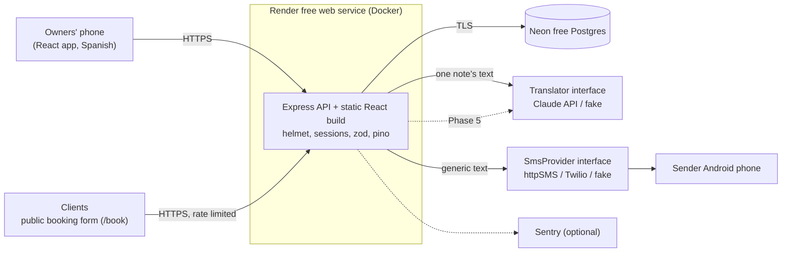
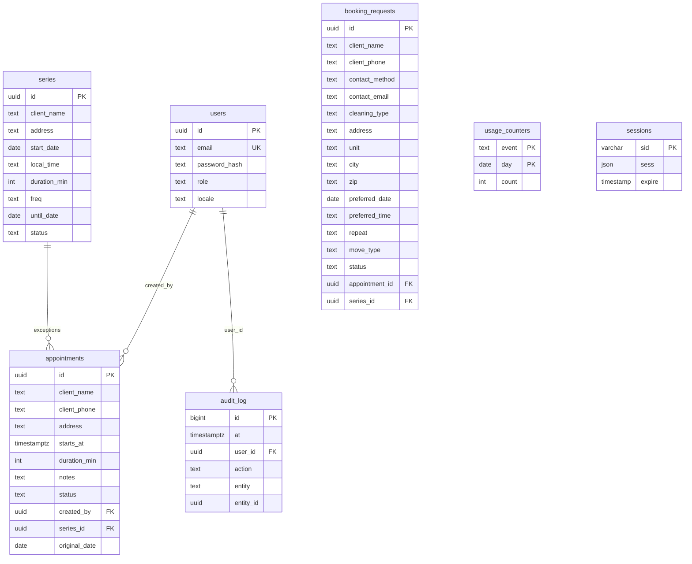

# Architecture

AnyGer's Housekeeping is **one Node app and one Postgres database**. The Express server exposes a JSON API and also serves the built React app, so there is a single deploy, a single URL, and a single thing to monitor.

## System diagram



Dotted lines are later phases or optional.

## Why this size is right (no microservices, no Kubernetes)

The load is two users and a few requests an hour. Splitting into services would add network failure modes, deploy pipelines, and cost, and would buy nothing at this scale. A modular monolith with clear internal seams (`domain/`, `services/`, `routes/`, and adapter interfaces for SMS and translation) is cheap to run and easy to change. If it ever outgrew this, those seams are where it would be split.

## Postgres vs SQLite

SQLite would perform fine at this data size (hundreds of rows a year). Postgres was chosen because:

- Free hosts often have **ephemeral disks**; a SQLite file there can vanish with a redeploy. A managed Postgres survives redeploys and has provider backups.
- `timestamptz` and range operators (used for overlap detection) are first-class.
- Tests run against **real Postgres** in CI, the same engine as production.

Cost of the choice: one more moving part locally (Docker Compose) and a network hop. Accepted.

## Data model



Phase 2 added `series` and two columns on `appointments` (`series_id`, `original_date`; see Recurrence below). Phase 3 added `booking_requests` (later extended with contact preference, cleaning type, move-in/out, and a structured address). Planned: `translations` (Phase 5).

## Key decisions and tradeoffs

### Time zones

- **Stored as UTC** `timestamptz`. **Displayed in America/Los_Angeles.**
- Conversion lives in one module, `server/src/domain/time.ts`, using Luxon. The **server** returns each appointment's Pacific `date` and `time`; the browser never converts time zones for appointments, so there is one place to get DST right.
- Spring forward: a time that does not exist (02:30 on 2026-03-08) is **rejected** with a plain-language error instead of silently shifting.
- Fall back: an ambiguous time (01:30 on 2026-11-01) resolves to the **first** occurrence (daylight time). Documented and tested.
- Range queries ask for whole Pacific days, so days are 23, 24, or 25 hours long around DST and tests assert this.
- Tradeoff: the calendar is fixed to Pacific Time. Right for this business; a per-business time zone setting would be needed to generalize.

### Recurrence (built in Phase 2)

- A **series** stores the rule: a Pacific start date, a wall-clock time (`"09:00"`), a frequency (`weekly`, `biweekly`, `monthly`), and an optional inclusive end date. Visits are **generated for the days on screen** (`domain/recurrence.ts`), not stored, so a series is one row however long it runs.
- **Monthly means the same weekday of the month** (e.g. the 2nd Tuesday). A series that starts on the 29th-31st means "the last <weekday>", so no month is ever skipped. The API returns the ordinal so the label ("2nd" vs "last") is always right.
- Only **exceptions** are stored: an edited or cancelled single visit is a row in `appointments` with `(series_id, original_date)`, unique per visit. When listing, a generated visit is dropped if an exception exists for its date, so a moved visit shows once, at its new time.
- Two edit scopes, deliberately, to keep choices few for non-technical users: **only this one** (writes or updates an exception) and **this and the following**. The latter ends the old series the day before and starts a new one (or edits the series in place when started from the first visit); one-off edits after that point are replaced. "Edit the whole series" is "this and the following" from the first visit, and past visits are never rewritten.
- **Daylight saving:** generation uses the stored wall-clock time, so 9:00 AM stays 9:00 AM while its UTC value shifts. A generated visit whose time does not exist that day (e.g. 02:30 on spring-forward) moves to the next valid time instead of failing; a time typed in by a person is still rejected. Tested at both transitions.
- Tradeoffs: listing does a little more work than reading rows (fine at this scale), and "this and the following" discards later one-off edits (the same behaviour as common calendar apps, and called out in the UI by the question itself).

### Language

Spanish is the default. The one-tap toggle stores the choice **per device** in `localStorage` (guarded, since storage can be blocked), because the owners share one login and may prefer different languages. The server stays language-neutral: it returns error codes and the UI translates them. A test enforces that the Spanish and English files have identical keys.

### Public booking requests (built in Phase 3)

- **Separate table, not a half-made appointment.** A request is only the client's wish (preferred date/time, frequency, notes, language). It is _not_ on the calendar and cannot clash with anything until the owners accept it.
- **Accept creates the appointment from what the owners confirm**, via the same code path as a normal new appointment (so repeating requests become series). The form is the existing appointment form in an `accept` mode, prefilled, so there is one place that validates schedules.
- **Atomic claim.** Accepting runs `UPDATE ... WHERE status = 'pending'` first, so two people tapping at once cannot create two appointments; if creating the appointment then fails, the request is put back to pending.
- **Layered spam defense** because the form is open to the internet and a CAPTCHA would add friction for older clients: strict validation, hidden honeypot (a filled trap is silently dropped, so the bot learns nothing), 5/hour/IP rate limit, a hard cap of 100 pending requests, small body limit. Tradeoff: this stops casual bots and floods, not a determined distributed attacker; Cloudflare Turnstile (free) is the next step if real spam appears.
- **Short-lived personal data.** Decided requests are deleted after 30 days and unanswered ones after 60; a purge runs at startup and every 12 hours (the free host sleeps, so waking also purges).
- **Language travels with the request.** The client's language is stored so Phase 5 can translate their notes the right way.
- **Public route boundary.** `/book` is the only unauthenticated page; everything else, including every `/api/requests` route, sits behind `requireAuth`. Tests assert 401s for each owner route.

### SMS abstraction (built in Phase 4)

- `SmsProvider { name; send(to, body) -> {ok} | {ok:false, reason} }`. Business code only talks to a **notifier**, which only talks to this interface. Adapters: **httpSMS** (the one in use: your own Android phone sends the text, so it costs nothing beyond the phone's plan), **Twilio** (kept to prove swappability; mocked tests only; not free beyond a trial, so not used), and a **fake** for tests. Choosing one is a config value (`SMS_PROVIDER`), and a half-configured provider stops the server at startup instead of silently dropping texts.
- **Why not the obvious free options:** carrier email-to-text gateways are shut down or shutting down, Twilio is not free after a short trial, and Textbelt's free key allows one text a day. A phone you already own is the only durable free sender; the tradeoff is that the phone must stay on and online.
- **Texts are generic by design** ("you have a new request, open the app"), because they cross a third-party relay and a phone. They never carry a name, address, phone number, or note.
- **The notifier never blocks or fails a request.** It runs after the response logic, fire-and-forget, with a 5 s timeout; errors are contained, counted (`sms_sent`, `sms_failed`), and logged without personal data.
- **Guards, because the public form can now trigger a text:** a per-kind cooldown (burst becomes one text), a hard monthly cap under the free allowance, and a claim-before-send so concurrent events cannot double-send. State for the cooldown is in memory (fine for one instance; it resets on restart). The monthly cap is read from `usage_counters`, so it survives restarts.
- **Which events text:** new booking request; appointment created (including a new repeating series), changed, or cancelled. Accepting or declining a request does not (the owners just did it). The owners share a login, so the app cannot tell who made a change.

### Translation (built in Phase 5)

- **The Claude API is not free**, and this project never pays, so the real translator is **Cloudflare Workers AI** (free daily allowance that blocks instead of billing; says it does not train on or store content). A **Claude adapter** (official SDK, `claude-opus-5-5`, low effort, refusal fallbacks) is built and tested against a stand-in client but **off by default**; a setting turns it on. Both sit behind a small `Translator` interface with a fake for tests, like the SMS provider.
- **The original is always kept and shown first.** The UI renders the note as written, then, only if translation worked, a labelled "automatic translation" block beneath it. Nothing is ever overwritten.
- **The app works without it.** Every outcome is a normal answer (`disabled`, `same_language`, `unavailable`, ...); a failure shows a small "try again" under the untouched note. Translation is a convenience, never a dependency, and it is off until configured.
- **Translate only when needed.** A small deterministic detector (common Spanish/English words and ñ ¿ ¡) decides what language a note is in, so notes already in the reader's language make no provider call. It falls back to the form language the client used, and does nothing when unsure. It is deliberately conservative; the cost of a miss is an untranslated note, not a wrong one.
- **Cached, capped, and short-lived.** Keyed by a hash of (languages + text), so a note is translated once; capped at 200/day to protect the free allowance; cache rows deleted after 30 days.
- **The endpoint takes an id, not text,** and reads the note from the database, so it cannot become a free translation service.
- **Tradeoff:** machine translation by a smaller free model is less accurate than Claude on informal text. That is the price of staying free, and why the UI says "automatic" and keeps the original beside it.

### Authentication

- Email + password, argon2id, server-side sessions in Postgres (revocable), 90-day rolling cookie (`HttpOnly`, `Secure`, `SameSite=Lax`) so older users are not constantly logged out.
- One shared account for the owners; the schema supports more users and roles.
- CSRF: custom-header requirement + `SameSite`. See `SECURITY.md`.
- Tradeoff: sessions in Postgres cost one query per request; irrelevant at this scale and avoids JWT revocation problems.

### Overlapping appointments

A **warning, not a block**: the owners may have a crew. The API returns `overlaps: n` and the UI says so in plain Spanish.

### Free-tier hosting

Render free web service (sleeps after ~15 minutes idle, so the first open can take 30-60 s) + Neon free Postgres. A free uptime pinger on `/healthz` can keep it warm during the day. The database is plain Postgres, so leaving a provider is a `pg_dump` and restore. Risk: free-tier terms can change.

### Observability

- `pino` JSON logs (no PII), request ids, `/healthz` for the host.
- Optional Sentry with request data stripped.
- `usage_counters` hold anonymous daily counts (`appointments_created`, `appointments_cancelled`; later requests received, SMS sent, translations). Read them with SQL; they are the only source for any number quoted in a résumé.

## Folder structure

```
server/src/
  domain/        pure logic (time, later recurrence)
  routes/        HTTP handlers (thin)
  services/      DB access and business rules
  middleware/    auth + CSRF
  db/            pool, migration runner, SQL migrations
  scripts/       create-user CLI
web/src/
  pages/         Calendar, form, detail, cancel, login
  i18n/          es.json (default), en.json
  dates.ts       calendar math on plain date strings
```
